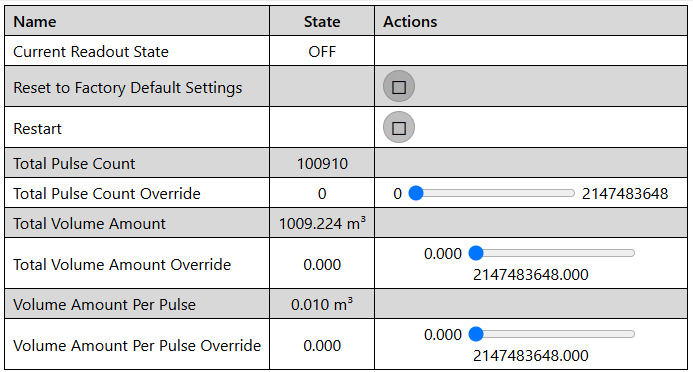
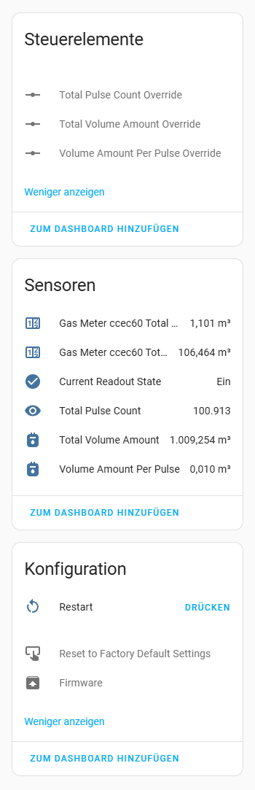

# Pulse counter for reading gas meters
Using an ESP32 and a reed sensor to read the magnetic pulse signals from a gas meter, enabling the calculation and tracking of gas usage.

## Setup and configuration
- Replace DEVICEID in the configuration with the actual ID of your ESP. This may have already been completed during the initial setup of the device.
- Configure the gpio pin in use with the reed sensor and verify the pull-up mode is set correctly.

## Adjustments
The exposed calculated outputs default to 0 pulses in total, 0 cubic meters total utilization and a volume of 0.01 cubic meters of tracked utilization per pulse. These values can be adjusted after the initial setup using the input values declared as overrides.

## Display
###### Dashboard

###### HomeAssistant  
