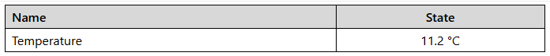
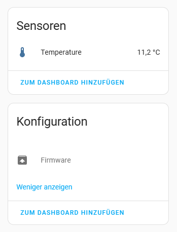

# Temperature probe using an DS18B20 sensor
Using an ESP32 and a DS18B20 temperature sensor to take temperature measurements

## Setup and configuration
- Replace DEVICEID in the configuration with the actual ID of your ESP. This may have already been completed during the initial setup of the device.
- Configure the gpio pin used for the OneWire connection as well as the protocol address of the sensor.

## Display  
###### Dashboard

###### HomeAssistant
